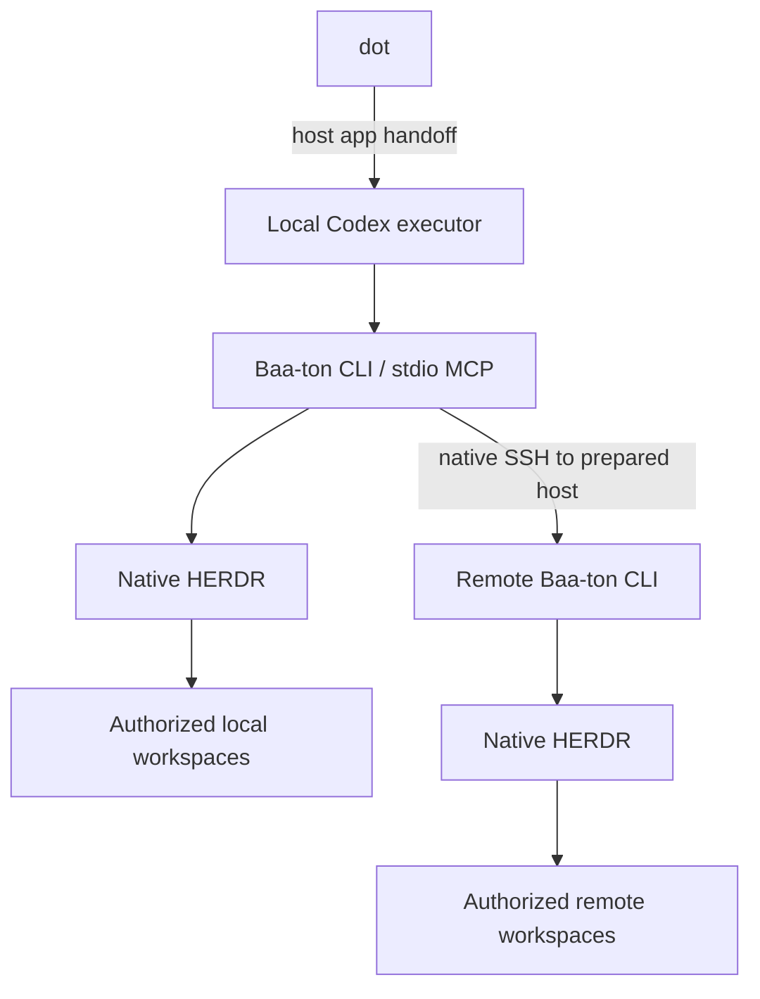

<p align="center">
  
</p>

<h1 align="center">Baa-ton</h1>

<p align="center"><strong>One voice. Your workspaces. Native agents.</strong><br />A small, local execution layer for steering work across HERDR—without building a second agent runtime.</p>

<p align="center">
  <a href="https://github.com/zachristmas/baa-ton/stargazers"></a>
  
  
</p>



The host app hands a request from **dot** to a **local Codex executor**. Baa-ton gives that executor a compact **CLI/MCP** for scoped goals, workers, messages, and evidence. **HERDR owns the panes, worktrees, and agents**. For remote scopes, Baa-ton uses native SSH to reach a prepared host-local Baa-ton CLI and HERDR runtime. Dot does not connect directly to a local MCP server.

## Get started

Requires Node.js 22.19+ and an installed HERDR CLI. Live qualification used CLI 0.9.1 (with HERDR server 0.9.0 compatibility confirmed). From a reviewed clone of this repository, run the project installer:

```sh
git clone https://github.com/zachristmas/baa-ton.git
cd baa-ton
./install.sh
```

Use `./install.ps1` in PowerShell or `install.cmd` on Windows. The installer previews the project changes before applying them. It asks you to choose workspaces, harnesses, profiles, and approval prompts. Keep your existing harness authentication and native permissions; Baa-ton does not configure a voice connector.

Once the project connection is enabled, ask local Codex to set a goal and dispatch work in your chosen scope. Each configured scope has its own goal and pause state, so a personal workspace can keep moving while a work workspace is paused. See the [operations guide](docs/OPERATIONS.md) for direct CLI examples and setup options.

## Why Baa-ton

- **Scoped by workspace.** Goals, pause/resume, and state belong to an explicitly configured scope, not whichever pane happens to be focused.
- **Native by design.** HERDR manages native resources; each selected harness keeps its own auth and permission behavior.
- **Evidence over “done.”** An idle pane is not proof of success. Workers report results; a human or reviewer verifies them.
- **Cleanup is opt-in.** It is disabled unless explicitly configured. Workspaces and worktrees are never removed by cleanup.

## Learn more

[Architecture](docs/ARCHITECTURE.md) · [Operations & configuration](docs/OPERATIONS.md) · [Design principles](docs/DESIGN-PHILOSOPHY.md) · [Migration & qualification history](docs/MIGRATION.md)

**Live qualification:** Codex was exercised on three hosts: local macOS, POSIX SSH, and Windows SSH. Claude Code, Pi, and OpenCode are supported worker adapters, but have not been live-qualified in this record.
