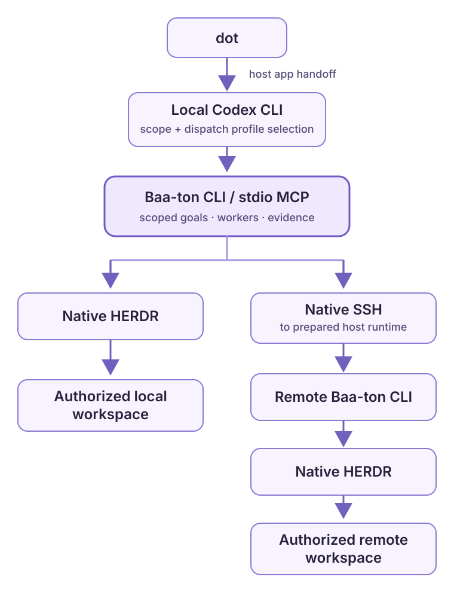

  

<h1 align="center">Baa-ton</h1>

<strong>One voice. Your workspaces. Native agents.</strong> A small, local execution layer for steering work across HERDR—without building a second agent runtime.

  
  
  

  

**The path:** dot → local Codex CLI control layer → Baa-ton CLI/MCP → native HERDR. The host app hands dot's request to Codex on your connected computer. Codex calls Baa-ton locally; Baa-ton makes explicit, scoped calls to HERDR or uses native SSH to a prepared remote runtime. Dot does not connect directly to a local MCP server.

## Set up from dot

On a computer connected to ChatGPT, ask dot to inspect the prerequisites and guide you through the existing Baa-ton installer for this workspace. Review the changes the installer proposes and approve the computer or project access that setup needs.

> Set up Baa-ton from https://github.com/zachristmas/baa-ton on my connected computer. Help me choose agent profiles for dispatch in this workspace, then show me how to repeat setup for another workspace.

The installer offers the same setup through its interactive terminal wizard or a reviewed agent-ready JSON plan. Setup is repeated for each project/workspace. Scopes keep goals and pause state independent, but they do not restrict which configured profile a dispatch or chain can select: choose a profile explicitly when assigning work. See [the agent JSON steps and terminal options](docs/OPERATIONS.md#one-installer-two-interfaces) for details.

**Prefer the terminal?** Requirements are Node.js 22.19+ and an installed HERDR CLI. Clone the repository and run `./install.sh` (macOS/Linux/WSL), `./install.ps1` (PowerShell), or `install.cmd` (Windows). The installer previews proposed changes before applying them. Live qualification used HERDR CLI 0.9.1 (with server 0.9.0 compatibility confirmed).

## Why Baa-ton

- **Scoped by workspace.** Goals, pause/resume, and state belong to an explicitly configured scope, not whichever pane happens to be focused. Worker profiles are selected separately at dispatch time.
- **Native by design.** HERDR manages native resources; each selected harness keeps its own auth and permission behavior.
- **Evidence over “done.”** An idle pane is not proof of success. Workers report results; a human or reviewer verifies them.
- **Cleanup is opt-in.** It is disabled unless explicitly configured. Workspaces and worktrees are never removed by cleanup.

## Learn more

[Architecture](docs/ARCHITECTURE.md) · [Operations & configuration](docs/OPERATIONS.md) · [Design principles](docs/DESIGN-PHILOSOPHY.md) · [Migration & qualification history](docs/MIGRATION.md)

**Live qualification:** Codex was exercised on three hosts: local macOS, POSIX SSH, and Windows SSH. Claude Code, Pi, and OpenCode are supported worker adapters, but have not been live-qualified in this record.
