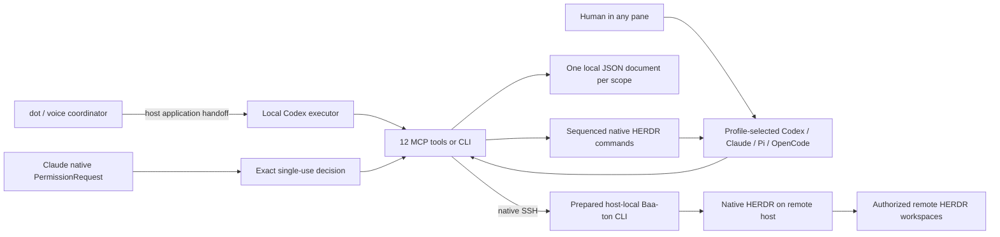

# A thin execution path from dot to native HERDR

The primary workflow is dot → local Codex executor → Baa-ton CLI/MCP → native HERDR, with Baa-ton using native SSH to reach a prepared host-local Baa-ton CLI and HERDR for remote scopes. The CLI/MCP execution layer and SSH routing are implemented here. The surrounding application's conversation/task handoff supplies the first arrow; there is no direct dot-to-local-MCP connector in this repository. Fast is an explicit supported profile choice, not a global model setting.

`src/herdr.mjs` has a fixed list of native operations using argv arrays and no shell. `profiles.mjs` maps explicit profiles to documented launch options. No adapter registry or runtime capability negotiation is added. Remote scopes use one native SSH invocation of this same host-local CLI, with explicit Node/runtime/config paths and immutable account/endpoint binding. The JSON tool payload stays on stdin; POSIX quoting and an encoded fixed PowerShell command cover the two supported host types. Native `--machine` remains available for diagnostics; dispatch uses the prepared host-local runtime.

`core.mjs` sequences those primitives and records six conceptual entities: scope goal, job, message, result/verification evidence, permission request, and chain. Five collections/fields plus binding/revision metadata live in one scope file; result/verification is embedded in its job. Native process status is queried, not mirrored into a second supervisor graph.

Short atomic JSON transactions use a per-scope directory lock. Native operations run outside that lock and use durable intent/claim records, task revisions and immutable native identity checks. Process identity is only a bridge until HERDR discovers the native session. A discovered session is pinned; changing it requires explicit reconnect. Native operations already in flight cannot be recalled atomically; late results are recorded without resurrecting cancelled or superseded work.

A crashed lock is not reclaimed by a guessed timeout. Inspect its owner and remove only that abandoned lock after confirming the owner exited. Atomic rename prevents partial JSON; this is a local filesystem implementation, not a distributed database or a power-loss durability guarantee. Messages/history are retained for inspection; there is no automatic compactor or retention service.

`mcp.mjs` implements stdio JSON-RPC, tool schemas, initialization, bounded input and wait cancellation with Node built-ins. Pi registers the same tools through its public extension API. `host-policy.mjs` compiles an exact tool ask-list to Codex's native settings; it does not mint generic grants. Native approval records separately bind identity, revision, tool/input, digest and expiry.

`install.mjs` owns seven project skill files per selected harness. `setup.mjs` supplies both the terminal wizard and agent JSON mode, validates before writing, and can install project-local connections. Managed files have ownership hashes and conflicts are reported before normal writes. A disk failure can interrupt a multi-file installation; the per-file ownership journal supports inspection/retry. No filesystem-wide transaction is claimed.

The OS user remains the trust boundary. A worker with arbitrary shell access could edit same-user files or invoke native HERDR directly. Scoped MCP tool restrictions, schema validation, worktrees and native permission settings are useful boundaries, but they are not a hostile multi-tenant sandbox. Work/personal account access must be scoped by the host environment and the user's actual authorization.
